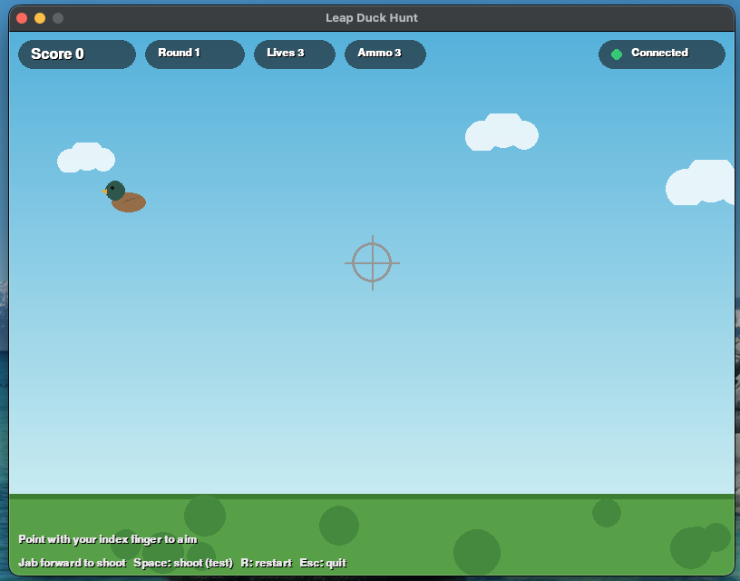
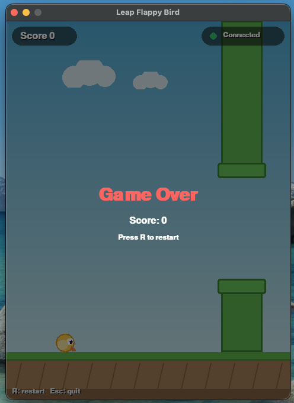

# Leap Motion AI Game

Hand-tracked arcade games built on the Ultraleap / Leap Motion Controller. Point,
flap, and aim with your bare hand — no mouse, keyboard, or controller required.

**Demo video:** [https://youtu.be/h-6UThW9-8Q](https://youtu.be/h-6UThW9-8Q)

## Screenshots

| Leap Duck Hunt | Leap Flappy Bird |
| --- | --- |
|  |  |

## How it works

Modern Ultraleap hardware speaks a native C API (LeapC) rather than the old
WebSocket protocol the original Leap Motion Controller exposed. This project
bridges the two:

```
Ultraleap Tracking Service (LeapC)
        |
        v
UltraleapTrackingWebSocket   <-- C bridge, re-serves LeapC frames as the
   (Ultraleap-Tracking-WS)       legacy ws://127.0.0.1:6437/v6.json protocol
        |
        v
   Python game clients        <-- pygame + websocket-client, no C/SDK
   (leap_flappy_bird.py,          dependency needed on the client side
    leap_duck_hunt.py)
```

`UltraleapTrackingWebSocket/` is a small CMake/C project (using `libwebsockets`
and Ultraleap's `LeapSDK`) that connects to the tracking service and streams
hand-tracking frames out over a WebSocket, in the same JSON shape the original
Leap Motion Control Panel used to serve. Any client that speaks that protocol
— including tools built for the original Leap Motion Controller years ago —
can consume it without touching the C SDK directly.

The two games are plain Python/pygame scripts that connect to that WebSocket
and read palm position, palm velocity, and per-finger data (tip position,
extended/curled state) out of each frame.

## Games

### Leap Flappy Bird (`leap_flappy_bird.py`)

Classic flap-to-fly, controlled by hand height. Hold your palm above the
sensor — raise it to climb, lower it to dive — and thread the bird through
the pipes.

- **Controls:** palm height above the sensor controls altitude. `Space` is a
  keyboard fallback (gives an upward impulse) for testing without the sensor.
- **Keys:** `R` restart, `Esc` quit.

### Leap Duck Hunt (`leap_duck_hunt.py`)

A point-and-shoot gallery game. Point with your index finger (other fingers
curled) to aim a crosshair, then jab your finger forward — like pulling a
trigger — to shoot. Ducks fly in wavy arcs from alternating sides of the
screen, picking up speed each round; miss three and it's game over.

- **Controls:** point with your index finger to aim; jab forward to shoot
  (detected from fingertip velocity). `Space`/mouse click is a keyboard
  fallback for testing without the sensor.
- **HUD:** score, round, lives, ammo (3 shots per duck), and live connection
  status.
- **Keys:** `R` restart, `Esc` quit.

Both games are original code and art — procedurally drawn sprites and
backgrounds, no external assets.

### Leap Handy Bridge (`leap_handy_bridge.py`)

A bonus utility, not a game: a gesture-triggered voice/intent pipeline. A
point or raised-open-palm gesture toggles local speech-to-text recording
(via [Handy](https://github.com/cjpais/Handy)), grabs the transcript from the
clipboard, and routes it to an LLM/agent call of your choosing. See the
docstring at the top of the file for setup assumptions.

## Setup

### 1. Build the tracking bridge

Requires the [Ultraleap Hand Tracking service](https://leap2.ultraleap.com/downloads/leap-motion-controller/)
(for the LeapSDK) and [libwebsockets](https://libwebsockets.org/).

```bash
# macOS, via Homebrew
brew install libwebsockets

cd UltraleapTrackingWebSocket
mkdir -p build && cd build
cmake ..
make
```

This produces `Ultraleap-Tracking-WS`, which opens a connection to the
Ultraleap tracking service and serves hand-tracking frames on
`ws://127.0.0.1:6437/v6.json`.

Run it before starting either game:

```bash
./Ultraleap-Tracking-WS
```

### 2. Install Python dependencies

```bash
pip install pygame websocket-client
```

(`leap_handy_bridge.py` additionally needs `pyperclip`.)

### 3. Play

```bash
python3 leap_flappy_bird.py
python3 leap_duck_hunt.py
```

Both games show a live connection indicator in the HUD, and fall back to
keyboard/mouse input so you can test the game loop without a sensor attached.

## Repository structure

```
leap_flappy_bird.py            Flappy Bird, hand-height controlled
leap_duck_hunt.py               Point-and-shoot duck gallery game
leap_handy_bridge.py            Gesture-triggered voice pipeline (utility, not a game)
UltraleapTrackingWebSocket/     C bridge: LeapC -> legacy WebSocket protocol
docs/screenshots/               README screenshots
```
